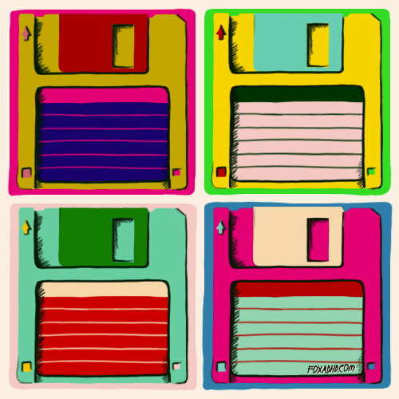

Dobro došli na prvi srpski **Floppy Challenge**! Pozivamo vas da
učestvujete u vrhunskom okršaju, za koji su potrebne vešte ruke, precizno oko
i 1.44 MB prostora! Spremite se i dođite na [GeekNight](http://heapspace.rs/geeknight/)
sa svojim najboljim flopijima!
{: .focus}

## Istorija

Jako davno, lep mladić po imenu Bil je slučajno bacio flopi disk za potrebe
reklamiranja svoje mikro kompanije:

{: .align-center style="height: 325px"}

Ovaj trenutak je bio prekretnica u svetu tehnologije. Svi su poželeli da bacaju
taj famozni flopi disk! Slučajno je dolazio sa softverom kompanije, pa su neki
diskovi i završili u kompjuterima. U svakom slučaju, istorija bacanja flopi
disketa je započela!

## Pravila

1. O Floppy challengu se priča svima.

2. O Floppy challengu se priča svuda.

3. Dolaze u obzir samo nemodifikovani 3.5'' flopiji od 1.44 MB.

4. Tim sme da sadrži samo 3.5 osoba.

5. Čik nađite flopije :)

{: .image .fit}
