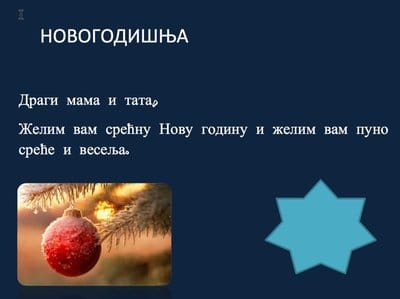

Internet opismenjavanje je program rada sa decom iz osnovnih škola.
Sastoji se iz više celina, i svaka se pojedinačno može sprovesti.
Sprovođenje programa zavisi i od opremljenosti škole. Poželjno je da
škola sprovede i program [Google Apps](../google-apps), pošto je za mnoge
zadatke ključan.

Sledi spisak celina koje su uključene u ovaj program.

## Elektronska pošta

Razumevanje rada interneta. Objasniti elektronsku poštu. Razlika sa
običnom poštom. Objašnjenje elektronske adrese. Privatnost i lozinka.

Svakom detetu napraviti naloge. Pokazati deci na primeru kako izgleda
prijava na email. Objasniti i šta je _browser_, kako se koristi, čemu služi.

Preporuka je da se koristi tkzv. _incognito_ mod, tj. "Mod bez praćenja".
Najčešći slučaj je da deca koriste iste pristupne naloge na školskim računarima,
te je u tom slučaju najpraktičnije da se radi u inkognito modu, kako se nalozi
ne bi mešali i, što je važnije, zbog privatnosti i ujednačenog pristupa.

Poželjno je formirati i link za mejl na nekoj lakoj adresi koju deca mogu da zapamte.
To može biti sajt škole ili već neki drugi domen. Osim naloga za decu,
ne bi bilo loše napraviti i zajedniči nalog za celo odeljenje itd.

Kasnije raditi na sastavljanju poruka: pisanju naslova, teksta, pridruživanju
fajlova.

Krajnji cilj je da deca bez muke savladaju sledeće korake:

+ prijava na školski računar
+ otvaranje browsera u _incognito_ modu
+ odlazak na email servis
+ prijava sa svojom email adresom
+ pregled pošte
+ slanje nove poruke drugarima
+ slanje poruke sa prikačenim fajlovima
+ odjava sa sistema i gašenje browsera

## Elektronska čestitka

Razumevanje razlike programa na računaru i internet servisa.
Startovanje programa za obradu teksta (najčeše je to _Word_). Savladati sledeće:

+ pisanje teksta različitim fontom
+ promena boja pozadine
+ ubacivanje oblika (_shapes_)
+ ubacivanje slika i njihovo stavljanje u pozadinu
+ snimanje sadržaja na disk
+ pronalaženje fajla na disku
+ export fajla u PDF i razumevanje različitih formata
+ slanje čestitke na mejl

Evo primera nekih čestitki koje su deca IV razreda izradila za 15 minuta.

{: .5u}
{: .5u}
{: .5u}
{: .5u}

## Raspored časova i grafik

Razumevanje _spreadsheet_ programa. Moguće je korišćenje on-line servisa
ili programa (najčeše je to _Excell_). Savladati sledeće:

+ pravljenje jednostavne tablice
+ formatiranje pojedinih ćelija (zaglavlja)
+ postavljanje podataka za grafik
+ umetanje jednostavnog grafika
+ razumeti vezu podataka i grafika

Najbolje je uzeti neki primer iz školskog života - recimo, raspodela ocena;
ili visina dece; i sl.

## Internet

Razumevanje interneta. Pojam prisustva na internetu. Objašenjenje sigurnosti
na internetu. Pregled popularnih servisa i pregled dobrih i loših strana istih
(Facebook, Instagram... ). Poseban naglasak je na sigurnom pristupu: pristup
u _inkognito_ modu, obraćanje pažnje o deljenju privatnih informacija.
Podsticanje kreativnosti dece u smislu ličnog izražavanja, shvatanju da je to
sredstvo.

## Školske novine

Zajednički rad dece na školskim novinama. Novine su podeljene na celine, teme.
Grupa dece radi na istoj temi. Razumevanje kolaboracije. U praksi se pokazalo
da je nezgodno pustiti decu da sva rade na istom dokumentu u isto vreme, stoga
se savetuje da svaka grupa radi na svom dokumentu, koji se posle zajednički spaja.
Izrada finalne verzije novina u elektrosnkom formatu i slanje iste na mejl.
Dozvoljen je rad od kuće

+ rad sa programom za poštu
+ umetanje slika u dokument
+ razumevanje zajedničkog rada
+ rad u grupama
+ razumevanje _copy/paste_ koncepta