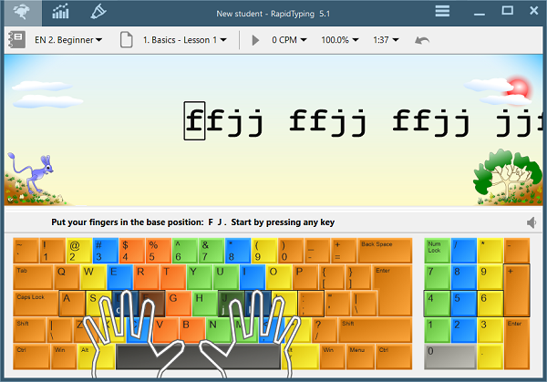
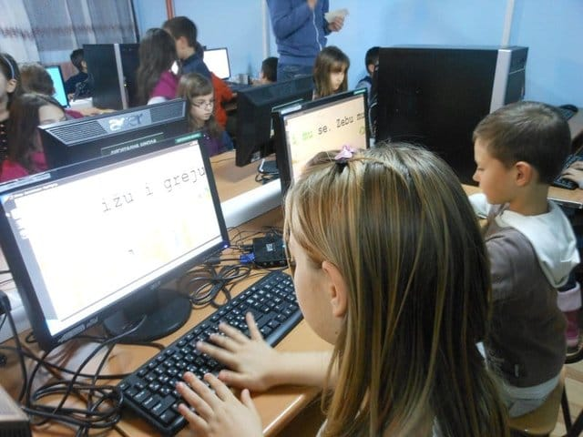
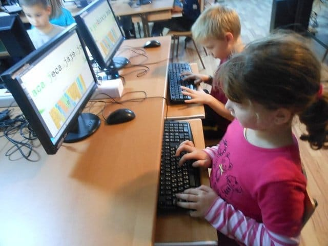
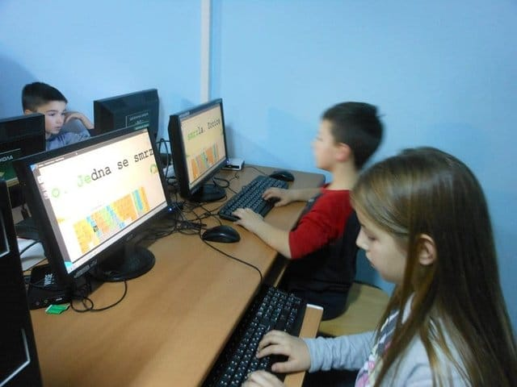
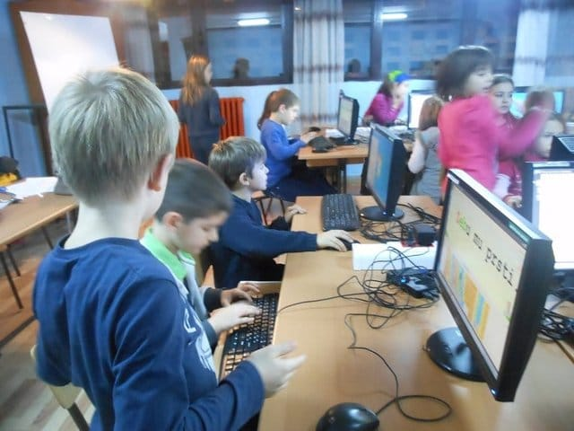
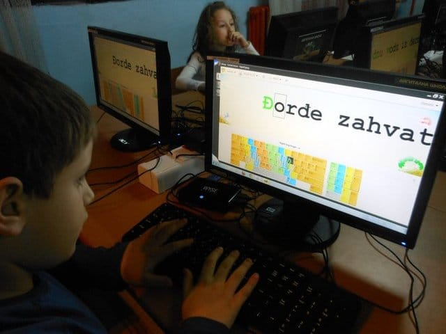
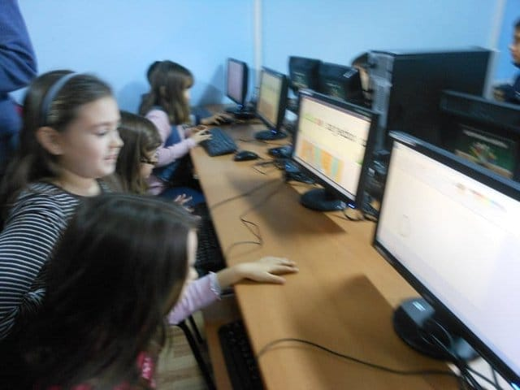
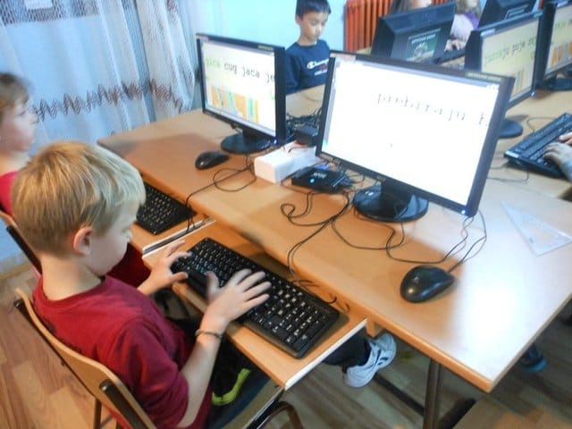

Program slepo kucanje je nastao kao ideja učiteljice **Ane Maravić**
iz **OŠ "Jovan Dučić"** sa Novog Beograda. Kako deca uče slova iz bukvara
(ćirlicu, pa potom latinicu), tako u isto vreme deca uče da kucaju ista ta slova
na tastaturi. Pri tome se vodi računa da deca sede pravilno, kao i da probaju
da koriste sve prste za kucanje.

Program je realizovan 2012-14.

## Cilj

+ Učenje slova ćirilice i latinice,
+ Upoznavanje sa rasporedom tastera,
+ Dostizanje upotrebljive brzine i tačnosti kucanja.

Dodatno:

+ Prvi kontakt sa računarskim sistemom,
+ Korišćenje programa za crtanje _Paint_.

## Uvodni čas

Pre susreta sa računarom, drži se jedan-dva uvodna časa. Deci se pokazuje
kako tastatura izgleda. Dele se papiri na kojima je odštampana "prazna" tastatura
([primer1](Blank_BRSB_Keyboard_Layout.svg), [primer2](katsbits-keyboard.png)).
Deca boje tastere žutom, plavom, narandžastom i zelenom bojom.
Obeležavaju crticom  tipke koja imaju ispupčenja (FJ) i objašnjava im se čemu služe.
Pokazuje se tipka za razmak između reči. Papiri se zatim ubacuju u plastične folije
radi zaštite. Objašnjava se kako se broje prsti: za palčeve kažemo da su prvi,
za kažiprste drugi, za srednje prste treći, domali je četvrti, a najmanji je peti.
Vežba se isto. Na kraju, deca postavljaju ruke i prste na papir i oponašaju
kucanje.

## Učenje slova

Plan predviđa da svaka lekcija kucanja uključi po dva (nova) slova. Pred svaki
rad na računaru, deci se pokazuje gde se nova slova nalaze. Deca zapisuju ta
slova na papiru-tastaturi običnom olovkom, zatim crnim tankim flomasterom.
Objašnjava se kojim se slovom kucaju nova slova. Deca vežbaju slova na foliji.
Potom tek pristupaju programu na računaru.

Jedan od prvih časova je predviđen i za učenje posebnih tastera i znakova.
Od znakova tu su znaci interpukcije. Od posebnih tastera skreće se pažnja na
taster _Shift_ kojim se kucaju velika slova. Objašnjava se postupak kucanja
velkih slova: prvo se pritisne i drži _Shift_, a potom se kuca slovo koje žele
da bude veliko.

Jedna lekcija kucanja na računaru traje oko 20-30 minuta. Svaka lekcija se ponavlja
dva puta.

Kada se pređu lekcije svih slova, deca kucaju kraće tekstove iz Bukvara.

### Crtanje

Deca koja pre ostalih uspešno završe sa lekcijom ponekad mogu da crtaju
u kompjuterskom programu _Paint_. Ponekada, raznovrsnosti radi, deci se
zadaju zadaci koje treba da nacrtaju - pošto se crtanje radi sklapanjem
geometrijskih figura (na pr: jelka = trouglovi i pravougaonik). Uvek se
zahteva i ispisavanje neke poruke na slici, kao primena stečenog znanja
u kucanju.

## Program

Za obuku se korisiti bilo koji dostupan program za brzo kucanje. Međutim,
plan po kome program radi se mora promeniti, pošto deca uče slova
različitim redosledom nego što je uobičajeno u programima za brzo kucanje.

Za Windows platformu preporučeni program je: [RapidTyping 5](http://www.rapidtyping.com/downloads.html).
Program je besplatan, postoji i u tkzv _portable_ varijanti. Najvažnije je da
je lak za upotrebu i vizuelno vrlo prilagođen deci - ekran je šaren i zabavan,
ali ne ometa pisanje. Postoji i prevod programa na srpski, čime se još više
olakšava okruženje. Na kraju svake lekcije prikazuje statistiku, koja je zgodna
kao nagrada detetu.

## Plan

Kompletan plan se nalazi na našem [GitHub folderu](https://github.com/HeapSpace/kids/tree/master/slepo-kucanje).
Plan za ćirilicu je dat u tekstualnoj formi, ali i u formi prilagođenoj
programu _RapidTyping_.

Sadržaj je objavljen pod [Creative Commons 4 licenceom](http://creativecommons.org/licenses/by/4.0/).

## Uživo :)

(sve obljavljene fotografije dece imaju saglasnost roditelja)

{: .5u}
{: .5u}
{: .5u}
{: .5u}
{: .5u}
{: .5u}
{: .5u}