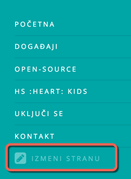
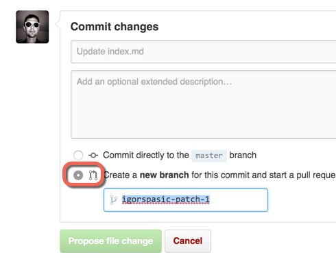

# Izmena sadržaja

Ovo je kratak tutorijal kako menjati sadržaj sajta online, direktno iz
pretraživača.

## Predznanje

Pogledati [markdown](https://daringfireball.net/projects/markdown/syntax),
to je format u kome je napisan sadržaj - tačnije, korišćena je [kramdown](http://kramdown.gettalong.org/quickref.html)
varijanta.

Potrebno je razumeti i _promenljive_ (u _headeru_ strane). Pomoću njih se
uključuju/isključuju delovi strana i funkcionalnosti. Spisak i objašnjenje
je dato u [ovom fajlu](../METADATA.md).

Naravno, morate biti ulogovani na [GitHub](http://github.com) da bi radili izmene.

## Koraci

### 1. Izbor iz menija

Idi na stranu koju želiš da izmeniš. Otvori _meni_ i izaberi opciju `IZMENI STRANU`.

Otvoriće se sors strane na GitHub, spreman za izmene.

### 2. Izmena sadržaja

Izmenite sadržaj.

### 3. Snimanje izmena

Izmene se snimaju _komitovanjem_ (engl.: _commit_). Time se izmene snimaju.
Za svaku izmenu treba staviti i kratak opis.

Postoji dva načina kako se izmene snimaju:

+ direktno (na _master_) - ove izmene ODMAH postaju vidljive. Preporučuju se
  kada ste sigurni da se ništa neće pokvariti :)
+ slanje na review (kao novi _branch_ i _pull request_) - izmene se šalju na
  review. Tek kada se potvrde, biće primenjene i vidljive. Ovo je PREPORUČENI način
  izmena:

### 4. Osmehni se

To je to:)
